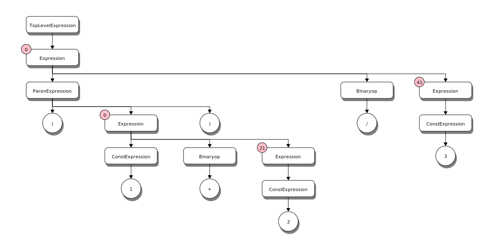

# 2. Kaleidoscope: Implementing the parser
The Lllvm.NET version of Kaleidoscope leverages ANTLR4 to parse the language into a parse tree.
The chapter 2 sample doesn't actually generate any code. Instead it focuses on the general structure
of the samples and parsing of the language. The sample for this chapter enables all language features
to allow exploring the language and how it is parsed to help better understand the rest of the chapters
better. It is hoped that users of this library find this helpful. Understanding the language grammar
from reading the LVM tutorials and source was a difficult task since it isn't formally defined in one
place. (There are some EBNF like comments in the code but it is spread around without much real discussion
of the language the tutorials guide you to implement)

## Formal Grammar
### Lexer symbols

The Kaleidoscope lexer consists of several tokens and is defined in the Kaleidoscope.g4 grammar file

```antlr
// Lexer Rules -------
fragment NonZeroDecimalDigit_: [1-9];
fragment DecimalDigit_: [0-9];
fragment Digits_: '0' | [1-9][0-9]*;
fragment EndOfFile_: '\u0000' | '\u001A';
fragment EndOfLine_
    : ('\r' '\n')
    | ('\r' |'\n' | '\u2028' | '\u2029')
    | EndOfFile_
    ;

LPAREN: '(';
RPAREN: ')';
COMMA: ',';
SEMICOLON: ';';
DEF: 'def';
EXTERN: 'extern';

ASSIGN:'=';
ASTERISK: '*';
PLUS: '+';
MINUS:'-';
LEFTANGLE: '<';
SLASH: '/';

EXCLAMATION: '!';
PERCENT: '%';
AMPERSAND:'&';
PERIOD:'.';
COLON: ':';
RIGHTANGLE: '>';
QMARK: '?';
ATSIGN: '@';
BACKSLASH: '\\';
CARET: '^';
UNDERSCORE: '_';
VBAR: '|';
EQUALEQUAL: '==';
NOTEQUAL: '!=';
PLUSPLUS: '++';
MINUSMINUS: '--';

IF:     {FeatureControlFlow}? 'if';
THEN:   {FeatureControlFlow}? 'then';
ELSE:   {FeatureControlFlow}? 'else';
FOR:    {FeatureControlFlow}? 'for';
IN:     {FeatureControlFlow}? 'in';
VAR:    {FeatureMutableVars}? 'var';
UNARY:  {FeatureUserOperators}? 'unary';
BINARY: {FeatureUserOperators}? 'binary';

LineComment: '#' ~[\r\n]* EndOfLine_ -> skip;
WhiteSpace: [ \t\r\n\f]+ -> skip;

Identifier: [a-zA-Z][a-zA-Z0-9]*;
Number: Digits_ ('.' DecimalDigit_+)?;
```

This includes basic numeric patterns as well as Identifiers and the symbols allowed for operators and keywords
for the language. Subsequent chapters will introduce the meaning and use of each of these.

#### Language Feature Defined Keywords
Chapters 5-7 each introduce new language features that introduce new keywords into the language. In order to
maintain a single grammar for all chapters the lexer uses a technique of ANTLR4 called [Semantic Predicates](https://github.com/antlr/antlr4/blob/master/doc/predicates.md).
These are basically boolean expressions that determine if a given rule should be applied while parsing the
input language. These are applied to the rules for the feature specific keywords. Thus, at runtime, if a given
feature is disabled then the keyword is not recognized.

```antlr
IF:     {FeatureControlFlow}? 'if';
THEN:   {FeatureControlFlow}? 'then';
ELSE:   {FeatureControlFlow}? 'else';
FOR:    {FeatureControlFlow}? 'for';
IN:     {FeatureControlFlow}? 'in';
VAR:    {FeatureMutableVars}? 'var';
UNARY:  {FeatureUserOperators}? 'unary';
BINARY: {FeatureUserOperators}? 'binary';
```

>[!NOTE]
>There are some important distinctions in the Llvm.NET implementation of Kaleidoscope, in the operators allowed for
>User defined operators. The official LLVM version allows defining an operator '=', (in chapter 6). However,
>in Chapter 7, when Mutable variables are introduced the '=' is reserved by the language for assignment. Thus,
>any code written for chapter 6 with a user defined '=' operator would not work in later versions. Thus, the
>Llvm.NET version reserves the '=' in all versions, but allows the '==' operator. (It also adds the '++' and '--'
>tokens as user operators [The official LLVM implementation only allows a single character as the operator lexeme])
>
> Additionally the Llvm.NET implementation adds the built-in '^' operator for exponentiation.

### Parser

The parser, like the lexer, uses Semantic Predicates, that allows for dynamic adaptation of the grammar
and parser to handle variations or versions of the language. The Sample code uses that to selectively enable
language features as the chapters progress, without needing to change the grammar or generated parser code.
The parser code provides a simple means of expressing the language support level. Semantic predicates play
a vital role in supporting user defined operators with user defined precedence.

#### Parser grammar
A full tutorial on ANTLR is beyond the scope of this article but the basics should be familiar
enough to anyone acquainted with EBNF form to make enough sense out of it. Don't worry too much
about the details at this point as subsequent chapters will cover salient points as new features
are enabled.

##### Operators
In order to support the parser detecting attempts to overload built-in operators and to handle the fact that some
operators don't make any sense for unary operators (e.g. you can't create a user defined unary '=' operator. technically
you could implement that but it would make for some confusing code. If you really like hard to read and comprehend code
there are [other languages](https://en.wikipedia.org/wiki/Brainfuck) better suited to that end 8^) )

To manage detection of appropriate operator tokens the grammar uses a set of parser rules that group the operator
tokens by their allowed kinds. This allows subsequent rules to simply refer to the kind of operator expected and
not worry about the actual tokens involved. It also allows the parser to detect syntax and usage errors like
trying to create a user defined '+' operator.

```antlr
// built-in operator symbols
builtinop
    : ASSIGN
    | ASTERISK
    | PLUS
    | MINUS
    | SLASH
    | LEFTANGLE
    | CARET
    ;

// Allowed user defined binary symbols
userdefinedop
    : EXCLAMATION
    | PERCENT
    | AMPERSAND
    | PERIOD
    | COLON
    | RIGHTANGLE
    | QMARK
    | ATSIGN
    | BACKSLASH
    | UNDERSCORE
    | VBAR
    | EQUALEQUAL
    | NOTEQUAL
    | PLUSPLUS
    | MINUSMINUS
    ;

// unary ops can re-use built-in binop symbols (Except ASSIGN)
unaryop
    : ASTERISK
    | PLUS
    | MINUS
    | SLASH
    | LEFTANGLE
    | CARET
    | EXCLAMATION
    | PERCENT
    | AMPERSAND
    | PERIOD
    | COLON
    | RIGHTANGLE
    | QMARK
    | ATSIGN
    | BACKSLASH
    | UNDERSCORE
    | VBAR
    | EQUALEQUAL
    | NOTEQUAL
    | PLUSPLUS
    | MINUSMINUS
    ;

// All binary operators
binaryop
    : ASSIGN
    | ASTERISK
    | PLUS
    | MINUS
    | SLASH
    | LEFTANGLE
    | CARET
    | EXCLAMATION
    | PERCENT
    | AMPERSAND
    | PERIOD
    | COLON
    | RIGHTANGLE
    | QMARK
    | ATSIGN
    | BACKSLASH
    | UNDERSCORE
    | VBAR
    | EQUALEQUAL
    | NOTEQUAL
    | PLUSPLUS
    | MINUSMINUS
    ;
```

##### Initializers
Initializers are a useful re-usable rule to handle a common sequence in the language in multiple different contexts.
(sort of like a function in most programming languages, in fact, ANTLR rules are implemented in the generated parser
as methods). 

```antlr
// pull the initializer out to a distinct rule so it is easier to get at
// the list of initializers when walking the parse tree
initializer
    : Identifier (ASSIGN expression[0])?
    ;

```

##### Primary Expressions (Atoms)
There are a number of primary expressions (also known as 'Atoms') that are not left recursive in their definition.
These are split out to a distinct rule to aid in the support of left recursion and the need for user defined operator
precedence.

```antlr
// Non Left recursive expressions (a.k.a. atoms)
primaryExpression
    : LPAREN expression[0] RPAREN                                                 # ParenExpression
    | Identifier LPAREN (expression[0] (COMMA expression[0])*)? RPAREN            # FunctionCallExpression
    | VAR initializer (COMMA initializer)* IN expression[0]                       # VarInExpression
    | IF expression[0] THEN expression[0] ELSE expression[0]                      # ConditionalExpression
    | FOR initializer COMMA expression[0] (COMMA expression[0])? IN expression[0] # ForExpression
    | {IsPrefixOp()}? unaryop expression[0]                                       # UnaryOpExpression
    | Identifier                                                                  # VariableExpression
    | Number                                                                      # ConstExpression
    ;
```

Let's look at each of these in turn to get a better understanding of the language.

###### ParenExpression
```antlr
LPAREN expression[0] RPAREN
```
This is a simple rule for sub-expressions within parenthesis for example: `(1+2)/3` the parenthesis groups the
addition so that it occurs before the division since, normally the precedence of division is higher. The parse
tree for that expression looks like this:



###### FunctionCallExpression
```antlr
Identifier LPAREN (expression[0] (COMMA expression[0])*)? RPAREN
```
This rule covers a function call which can have 0 or more comma delimited arguments. The parse tree
for the call `foo(1, 2, 3);` is:


###### VarInExpression
```antlr
VAR initializer (COMMA initializer)* IN expression[0]
```
The VarInExpression rule provides variable declaration, with optional initialization. The scope of the
variables is that of the expression on the right of the `in` keyword. The `var ... in ...` expression is
in many ways like a declaration of an inline function. The variables declared are scoped to the internal
implementation of the function. Once the function produces the return value the variables no longer exist.

###### ConditionalExpression
```antlr
IF expression[0] THEN expression[0] ELSE expression[0]
```
Conditional expressions use the very common and familiar if-then-else syntax and semantics with one noteable
unique quality. In Kaleidoscope every language construct is an expression, there are no statements. Expressions
all produce a value. So the result of the conditional expression is the result of the sub expression selected
based on the condition. The condition value is computed and if the result == 0.0 (false) the `else` expression
is used to produce the final result. Otherwise, the `then` expression is executed to produce the result. Thus,
the actual semantics are more like the ternary operator found C and other languages:
```C
condition ? thenExpression : elseExpression`
```

Example:
```Kaleidoscope
def fib(x)
  if x < 3 then
    1
  else
    fib(x-1)+fib(x-2);
```
##### ForInExpression
The ForInExpression provides support for classic for loop constructs. In particular it provides a variable scope for a loop
value, a condition to test when to exit the loop and an optional step value for incrementing the loop value (default is 1.0).

```Kaleidoscope
extern putchard(char);
def printstar(n)
  for i = 1, i < n, 1.0 in
    putchard(42);  # ascii 42 = '*'

# print 100 '*' characters
printstar(100);
```
Note: That there are no statements in Kaleidoscope, everything is an expression and has a value. putchard() implicitly returns a
value as does printstar(). (e.g. there is no void return ALL functions implictly return a floating point value, even if it is always 0.0)
For loops with mutable values support in the language may provide a result that isn't always 0.0, for example:

```Kaleidoscope
# Define ':' for sequencing: as a low-precedence operator that ignores operands
# and just returns the RHS.
def binary : 1 (x y) y;

# Recursive fib, we could do this before.
def fib(x)
  if (x < 3) then
    1
  else
    fib(x-1)+fib(x-2);

# Iterative fib.
def fibi(x)
  var a = 1, b = 1, c in
  (for i = 3, i < x in
     c = a + b :
     a = b :
     b = c) :
  b;

# Call it.
fibi(10);
```

#### Parse Tree
The Llvm.NET implementation of Kaleidoscope doesn't use an AST per se. Instead it use the parse tree generated
by ANTLR with the addition of C# partial classes. ANTLR will generate a parser based on the grammar description
input file. This generated parser (and lexer) includes a context type for each rule of the grammar. The C# target
for ANTLR generates these types as partial classes so the they are extensible from the parser assembly without
needing to derive a new type or use virtuals etc. Thus, the Kaleidoscope.Grammar assembly contains partial class
extensions that provide simpler property accessors and support methods to where an additional AST is not needed.
(e.g. The parse tree is the AST)

See [Kaleidoscope Parse Tree Examples](Kaleidoscope-Parsetree-examples.md) for more information and example
diagrams of the parse tree for various language constructs.

## Basic Application Architecture

Generally speaking there are three main components to all of the sample chapter applications.

  1. The main driver application (e.g. program.cs)
  2. The parser (e.g. Kaleidoscope.Grammar assembly)
  3. The code generator (e.g. CodeGenerator.cs)

There is an additional utility support library Kaleidoscope.Runtime providing some common adapter/facade pattern
implementations for working with Kaleidoscope, ANTLR and Llvm.NET.

### Driver
While each chapter is a bit different from the others. Many of the chapters are virtually identical for the driver.
In particular Chapters 3-7 only really differ in the language level support. 

[!code-csharp[Program.cs](../../../Samples/Kaleidoscope/Chapter2/Program.cs#generatorloop)]

The ReplParserStack contains the support for parsing the Kaleidoscope language from the REPL loop interactive input.
The stack also maintains the global state of the runtime, which controls the language features enabled, and if user
defined operators are enabled, contains the operators defined along with their precedence.

After the parser is created the code generator is constructed. The code generator is responsible for most of the real work
of the language. The implementation of the generator is different for each chapter. However, since the generator is based
on the ANTLR4 generated KaleidoscopeParserListener (using a visitor pattern), and the chapters build on one another, for
the most part, it is fairly easy to diff the generators for each chapter to see the changes needed to introduce the feature
the chapter introduces. Each chapter will go into more details on this. Since the generator usually allocates resources in
Llvm.NET it implements IDisposable to ensure they are released as early as possible.

Inside the using statement for the code generator is the core loop for the language runtime. This starts by displaying
a brief "hello" message indicating the nature of the app and the language level supported. The actual REPL loop is handled
via a common library class `ReplLoop<T>` (in Kaleidoscope.Runtime) this class handles retrieving text from an input source
(default is Console.In) and producing a complete "statement" for parsings. (Technically speaking Kaleidoscope doesn't have
statements but to allow a user to type `[...] a+b<newline>+c`) without processing that as two expression invocations (`a+b` and `c`)
a semicolon is used to convey the user's intent that the code is complete and ready for evaluation. The ReplLoop class takes
care of this in a generalized manner. The ReplLoop can consume input from any `System.TextReader` and uses `System.Console.In`
as a default. When the loop detects a new line that doesn't have a semicolon it will generate a Ready state changed event
so the calling application can inform the user with a different prompt (in all the Llvm.NET samples this is '>'). Once a complete
expression is available, the loop will submit it to the parser to generate a parse tree. The loop then passes the parse tree
and the parser that created it to the generators Generate() method to actually generate the result. The result type of the
generator is the generic type parameter for `ReplLoop<T>` as the loop class doesn't need to use the result itself. The
loop will trigger the GeneratedResultAvailable event to allow the driver application to do whatever it wants with the results.

### Processing generated results
The calling application will generally hook an event handler to show the results of the generation in some fashion. For the
basic samples (Chapter 3-7) it indicates the value of any JITed and executed top level expressions, or the name of any functions
defined. Chapter 2 has additional support for showing an XML representation of the tree but the same basic pattern applies.
This, helps to keep the samples consistent and as similar as possible to allow diffs to focus on the changes for a particular
feature. The separation of concerns also aids in making the grammar, runtime and code generation unit-testable without the
driver. (Although that isn't implemented yet it is intended for the future to help broaden testing of Llvm.NET to more scenarios
and catch breaking issues quicker.)

[!code-csharp[Program.cs](../../../Samples/Kaleidoscope/Chapter2/Program.cs#ProcessResults)]

### Special case for Chapter 2
Chapter 2 sample code, while still following the general patterns used in all of the chapters, is a bit unique, it doesn't use
Lllvm.NET at all. It is only focused on the language and parsing. This helps in understanding the basic patterns of the code and
support and serves as an aid in understanding the language itself. Of particular use is the support for generating DGML and
[blockdiag](http://blockdiag.com) representations of the parse tree for a given parse (All of the diagrams in these tutorials
were created by creating the blockdiag files and then generating the SVG files from that). Having a nice visual
representation of a parser tree result is helpful to understanding the parsing and various parse tree node types.

The visual graph is also immensely valuable when making changes to the grammar so you can see the results of a parse and
more readily understand why something isn't right. (In fact this feature was enabled to track down bugs in the parsing for
user defined operator precedence that was difficult to figure out. Once the visualization was available it became quite easy
to see the problems). Thus, Chapter 2 is both a simple introductory example and tool for use when doing advanced language
tweaking.
