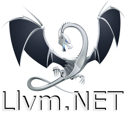

# Ubiquity.NET.Llvm
Ubiquity.NET.Llvm is a managed wrapper around an extended LLVM-C API including an Object Oriented model that closely matches 
the underlying LLVM internal object model. This allows for building code generation and other utilities
leveraging LLVM from .NET applications.

## Guiding principles

  1. Mirror the underlying LLVM model as much as possible while 
  providing a well behaved .NET projection including:
     1. Class names and hierarchies
     2. Object identity and reference equality
     3. [Fluent](https://en.wikipedia.org/wiki/Fluent_interface) APIs when plausible and appropriate
  2. Hide low-level interop details and the raw LLVM-C API.  
  The native model for LLVM is a C++ class hierarchy and not the LLVM-C API used for most
  language/runtime bindings. Ubiquity.NET.Llvm is designed to provide an OO model that faithfully reflects the
  underlying LLVM model while fitting naturally into .NET programming patterns.
  3. Leverage existing LLVM-C APIs underneath whenever possible
     1. Extend only when needed with custom wrappers
  4. FxCop/Code Analysis Clean

## Features
* LLVM Cross target code generation from .NET code
* JIT engine support for creating dynamic domain specific language
  runtimes with JIT support.
* Ahead of time compilation with support for Link time optimization and debug information
* Object model that reflects the underlying LLVM classes

## Releases
[Current](xref:current-release)  
[v10.0.0](xref:release-10-0-0)  
[v8.0.1](xref:release-8-0-1)  
