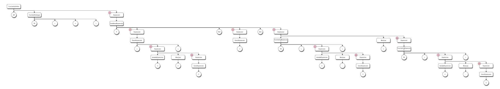
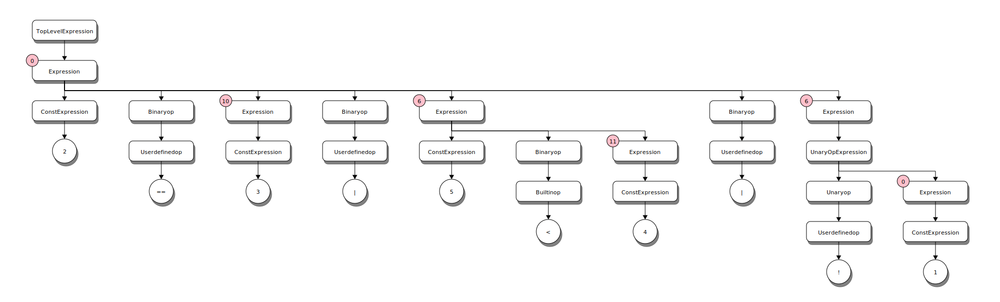

# Parse Tree Examples

## Simple Expressions (Chapters 3,4)

### Basic operators

`1 + 2 * 3 - 4 / 5 ^ 6;`


>[!NOTE]
>The small circle in the upper left corner of the Expression nodes is the precedence
>value at the entry to the rule. ANTLR uses a precedence climbing algorithm so this number
>indicates the precedence for the expression in relation to others.

>[!NOTE]
>The parse tree for the expression has 5 children that are in evaluation order. That is,
>evaluation of the expression starts at the left most child and proceeds across to the right
>most child. Since, all binary operations include an operator symbol the evaluation would
>consume the children (other than the first one) as an operator and right hand side pair.
>this is used in the code generation when processing expression nodes.

### If-Else control flow
Given the following definition of a recursive function to compute
Fibonacci numbers
```Kaleidoscope
def fib(x)
  if (x < 3) then
    1
  else
    fib(x-1)+fib(x-2);
```

The parse tree looks like this:



### For loop
Given the following kaleidoscope function definition:
``` Kaleidoscope
extern putchard(char);
def printstar(n)
  for i = 1, i < n, 1.0 in
    putchard(42)  # ascii 42 = '*'
```
The parse tree looks like this:


### User defined operators

Given the following operator definitions:

```Kaleidoscope
# Logical unary not.
def unary!(v)
  if v then
    0
  else
    1;

# Define > with the same precedence as <.
def binary> 10 (LHS RHS)
  RHS < LHS;

# Binary "logical or", (note that it does not "short circuit")
def binary| 5 (LHS RHS)
  if LHS then
    1
  else if RHS then
    1
  else
    0;

# Define = with slightly lower precedence than relationals.
def binary== 9 (LHS RHS)
  !(LHS < RHS | LHS > RHS);
```

The expression `2 == 3 | 5 < 4 | !1;` generates the following parse tree


